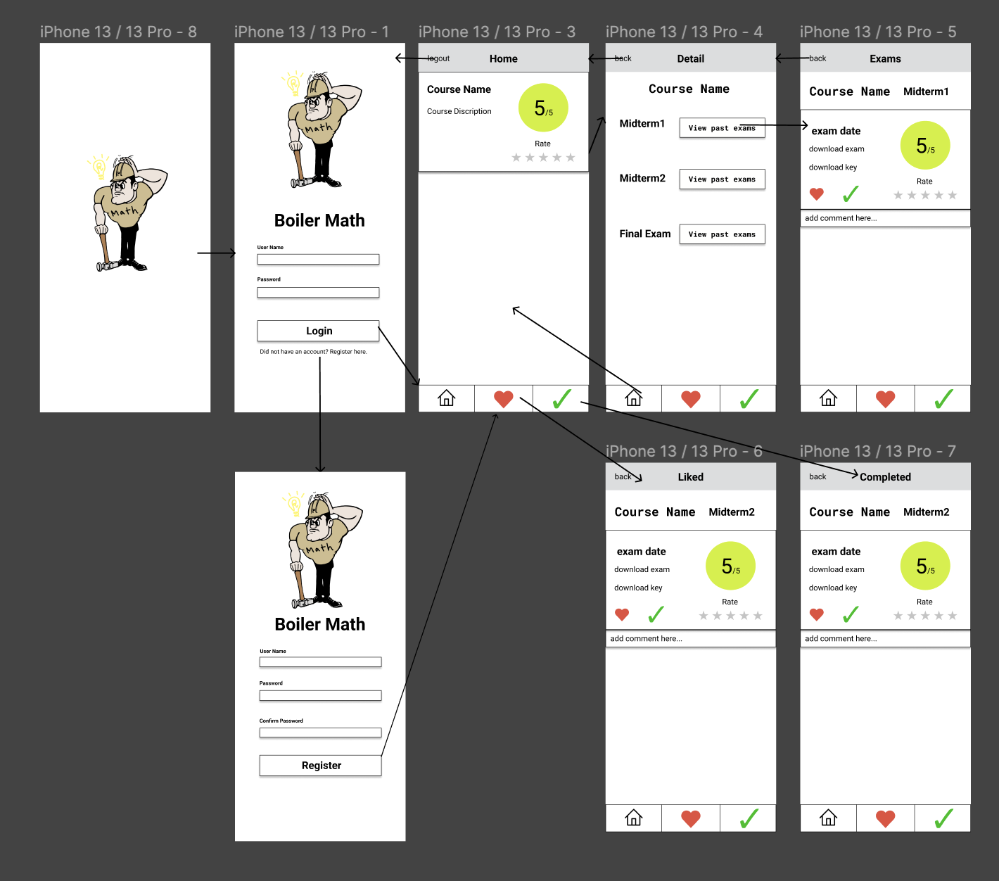

# Boiler Math

## Table of Contents
1. [Overview](#Overview)
1. [Product Spec](#Product-Spec)
1. [Wireframes](#Wireframes)
2. [Schema](#Schema)

## Overview
### Description
Learn math, check Purdue Math past exams and review for upcoming midterms and finals with this math learning app for Purdue Student! Your professors won't provide sample questions and past exams? Don't know how to prepare for  math exams and tests? Want to find more valuable questions to practice? Get unstuck ASAP with our app for a variety of authentic past math exams in Purdue University.
We’ve got you covered from basic arithmetic to advanced calculus and geometry. You CAN do math!

### App Evaluation
[Evaluation of your app across the following attributes]
- **Category:** Education
- **Mobile:** This app would be developed for ios.
- **Story:** Help students easily look up Purdue past math exams. Users can download every exam that they think is helpful and rate the difficulty of each exam. They can also comment their thoughts and solutions.
- **Market:** Any Purdue students who are taking Math classes or having trouble preparing for their upcoming exams.
- **Habit:** Purdue Students are using the app daily or before exams to check their performance and be well prepared.
- **Scope:** 

## Product Spec

### 1. User Stories (Required and Optional)

**Required Must-have Stories**

* User can create a new account
* User can login
* User can view an exam
* User can post a new comment to exams
* User can like an exam
* User can rate the difficulty of an exam
* User can download an exam

**Optional Nice-to-have Stories**

* User can upload an exam
* User can share an exam
* User can review the exams that they liked
* User can search for a specific exam
* User can follow other users
* User can view others' collection

### 2. Screen Archetypes

* Login Screen
   * User can log into their account
* Registration Screen
   * User can sign up a new account
* Stream 
   * User can view an exam
   * User can like an exam
   * User can download an exam
   * User can comment an exam
   * User can rate the difficulty of an exam
* Profile
   * User can view their identity and stats
   * User can review the exams that they liked
* Settings
   * User can configure app options and settings

### 3. Navigation

**Tab Navigation** (Tab to Screen)

* Home Page
* Completed exam Page
* Liked exam page

**Flow Navigation** (Screen to Screen)

* Login successful
   * => Home Page
* Registration successful
   * => Home Page
* Course
   * => which exam
* Exam
   * => which date
   

## Wireframes

### [BONUS] Digital Wireframes & Mockups

### [BONUS] Interactive Prototype

## Schema 
[This section will be completed in Unit 9]
### Models
[Add table of models]
### Networking
- [Add list of network requests by screen ]
- [Create basic snippets for each Parse network request]
- [OPTIONAL: List endpoints if using existing API such as Yelp]
